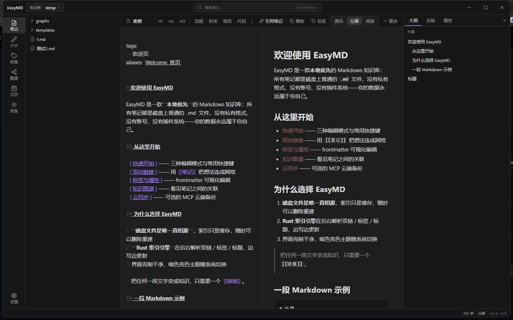
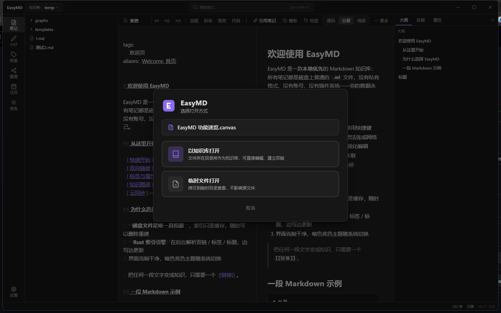
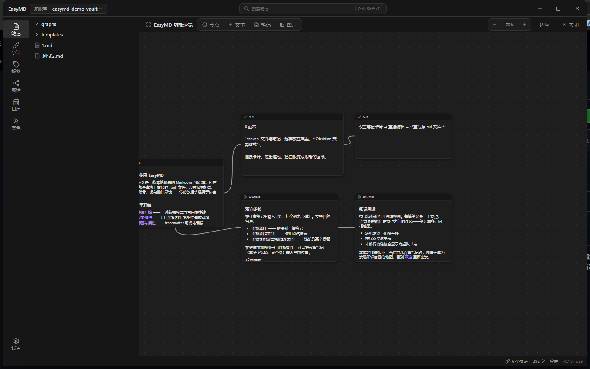
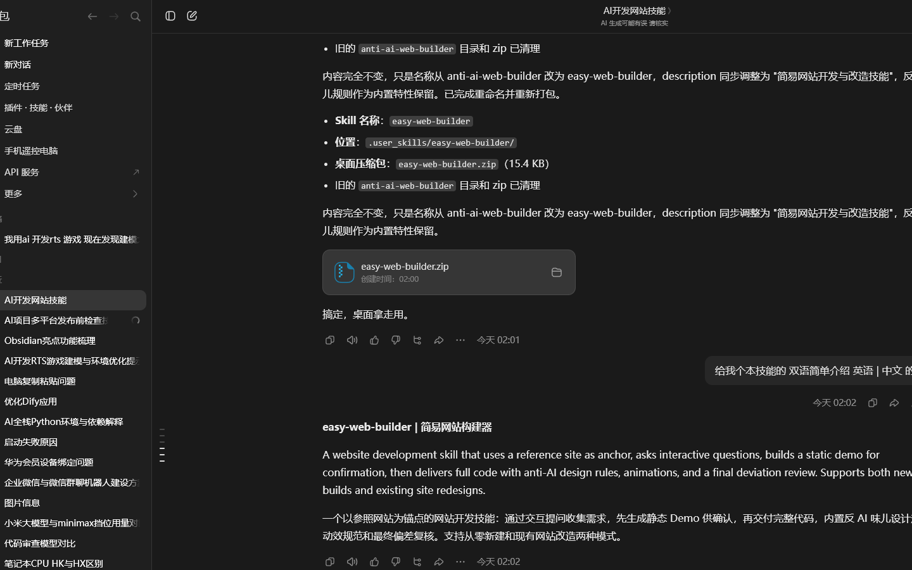

<div align="center">


# EasyMD

**本地优先的 Markdown 知识库桌面应用 / A local-first Markdown knowledge base**

磁盘上的 `.md` 文件就是全部数据 —— 无插件系统 · 无账号体系 · 无私有格式

[](https://github.com/FortC/Easy-MD)
[](https://tauri.app)
[](LICENSE)

[简体中文](#简体中文) · [English](#english)



</div>

---

## 简体中文

EasyMD 是一款桌面端 Markdown 知识库：一个本地文件夹就是一个库（vault），所有笔记都是普通的 `.md` / `.canvas` 文件。没有私有格式、没有账号、没有插件系统——**磁盘文件是唯一真相源，索引只是可随时重建的缓存**。

技术栈：Tauri 2 + Vue 3 + TypeScript + CodeMirror 6 + markdown-it + force-graph，后端索引引擎与文件 IO 全部为 Rust 实现。

### 核心特性

- **知识库 Vault**：一个本地文件夹即一个库；多库创建 / 打开 / 切换；文件树右键新建 / 重命名 / 删除（进系统回收站）；粘贴图片自动存入 `assets/`。
- **索引引擎（Rust）**：后台扫描解析 frontmatter / 标题 / 标签 / 双链，缓存存于系统配置目录（vault 之外），可随时删除重建；文件监听实时增量更新。
- **三种编辑模式**：源码（CodeMirror 6）/ 阅读 / 左右分屏（分隔条可拖拽调宽、双击复位），`Ctrl+E` 循环切换。
- **双向链接**：`[[笔记]]`、`[[笔记|别名]]`、`[[笔记#标题]]`、`[[笔记#^块id]]`；编辑器内高亮 + 自动补全；点击未解析链接可创建笔记；右侧反链面板。
- **嵌入语法**：`![[笔记]]`（整篇 / 标题 / 块）、`![[图片.png]]`。
- **图谱视图**：力导向关系图，缩放拖拽、标签过滤、孤立点开关、未解析链接虚拟节点。


- **Canvas 画布**：`.canvas` 文件（Obsidian 兼容格式子集）随 vault 存放；文本 / 笔记 / 图片三类卡片；笔记卡片双击编辑**直写源 md 文件**（双向绑定）；卡片拖拽缩放连线。



- **标签系统**：正文 `#tag` + frontmatter `tags`，多级 `#a/b/c`，左侧标签树点击筛选。
- **YAML 属性面板**：可视化编辑别名 / 标签 / 自定义字段，直接写回 md 头部。
- **模板与每日笔记**：自定义模板目录，支持 `{{title}}` / `{{date}}` / `{{time}}` 变量；日记快捷键一键创建。
- **搜索**：`Ctrl+P` 文件名 / 别名快速打开，`Ctrl+Shift+F` 全文搜索（跳转到行）。



- **导出**：md（原样保留 `[[ ]]` 标记）/ HTML（单文件、链接转换、图片内联）/ PDF（打印另存为）。
- **MCP 云同步（可选）**：通过 MCP 协议对接外部云服务（腾讯云 COS、百度网盘等 MCP 服务端），软件只做 MCP 客户端；多套配置切换、手动 / 定时同步、进度与失败提示；**不配置完全不影响离线使用**。
- **主题**：Obsidian 风格暗 / 亮双主题（CSS 变量），支持自定义 CSS 片段。



- **系统集成**：Windows 资源管理器右键 `.md` / `.markdown` / `.canvas` →「用 EasyMD 打开」；单实例运行，右键新文件会聚焦窗口并直接打开该笔记。

### 快捷键

| 按键 | 功能 |
|---|---|
| `Ctrl+E` | 循环切换编辑模式（源码 → 分屏 → 阅读） |
| `Ctrl+P` | 快速打开（文件名 / 别名搜索） |
| `Ctrl+Shift+F` | 全文搜索 |
| `Ctrl+N` | 新建笔记（可选模板） |
| `Ctrl+D` | 打开 / 创建今日笔记 |
| `Ctrl+G` | 图谱视图 |
| `Ctrl+,` | 设置 |
| `Ctrl+S` | 立即保存（编辑器本身 400ms 防抖自动保存） |

### 快速上手

1. 确保系统有 WebView2 运行时（Windows 10/11 一般自带）。
2. 下载 [Releases](https://github.com/FortC/Easy-MD/releases) 中的安装包或绿色版单文件 exe。
3. 首次启动选择「打开知识库文件夹」，指向任意一个存放 md 文件的目录即可。
4. 想先看看效果？本仓库自带一个演示库 [docs/demo-vault](docs/demo-vault)，用 EasyMD 打开这个文件夹就能体验全部功能。

### 开发

```bash
npm install
npm run tauri dev    # 开发调试
npm run tauri build  # 打包
```

要求：Node 18+、Rust stable（MSVC 工具链）。

打包产物：

- 独立绿色版：`src-tauri/target/release/EasyMD.exe`（单文件直接运行）
- NSIS 安装包：`src-tauri/target/release/bundle/nsis/EasyMD_0.1.0_x64-setup.exe`（中文向导、免管理员安装）

### 架构速览

```
src/                前端（视图层，不直接碰磁盘）
  stores/           Pinia 状态（vault / 索引镜像 / 编辑器 / 设置 / 同步）
  lib/markdown/     markdown-it 管线（wikilink / 嵌入 / 标签 / 导出渲染）
  lib/export.ts     md / html / pdf 导出
  components/       编辑器 / 文件树 / 标签 / 图谱 / 画布 / 搜索 / 设置
src-tauri/src/      Rust 后端
  index/            索引引擎：parser（frontmatter / 链接 / 标签）+ engine（扫描 / 缓存 / 增量）+ watcher（notify）
  commands/         tauri 命令：vault / fs / 搜索 / 索引 / 设置 / MCP
  mcp/              MCP 客户端（JSON-RPC over stdio）+ 双向同步引擎
  lib.rs            命令注册 + emdasset:// 资源协议（只读 vault 内文件）
```

### 数据边界

- vault 内只有 `.md` / `.canvas` / 资源文件——**无任何软件私有数据**。
- 设置、vault 列表、索引缓存、CSS 片段存于 `%APPDATA%/com.easymd.app/`。
- 删除缓存目录后重新打开 vault 会自动全量重建索引，笔记内容不受影响。

### MCP 同步说明

同步前请在 设置 → 云同步 添加 MCP 服务（command / args / env，与常见 MCP 客户端配置一致），点「测试连接」确认工具可用。软件按工具名自动绑定 列表 / 下载 / 上传 / 删除 操作（可在配置中手动指定）。同步策略：双向新增 / 更新（内容不同时较新者胜，云端无 mtime 时本地优先）；**不自动传播删除**以防误删，删除请在两侧手动操作。

### 许可证

[MIT](LICENSE)

---

## English

EasyMD is a desktop knowledge base for Markdown: one local folder is one vault, and every note is a plain `.md` / `.canvas` file. No proprietary format, no accounts, no plugin system — **files on disk are the single source of truth; the index is just a cache you can rebuild at any time**.

Built with Tauri 2 + Vue 3 + TypeScript + CodeMirror 6 + markdown-it + force-graph. The indexing engine and all file IO are written in Rust.

### Highlights

- **Vaults**: one local folder per vault; create / open / switch between multiple vaults; new / rename / delete from the file tree (delete goes to the system recycle bin); pasted images are stored in `assets/` automatically.
- **Rust index engine**: parses frontmatter / headings / tags / wikilinks in the background; the cache lives in the system config dir (outside the vault) and can be deleted and rebuilt at any time; a file watcher keeps it incrementally up to date.
- **Three edit modes**: source (CodeMirror 6), reading, and split view with a draggable divider (double-click to reset); cycle with `Ctrl+E`.
- **Bidirectional links**: `[[note]]`, `[[note|alias]]`, `[[note#heading]]`, `[[note#^block-id]]`; highlighted with autocomplete in the editor; click an unresolved link to create the note; backlinks panel on the right.
- **Embeds**: `![[note]]` (whole note / heading / block), `![[image.png]]`.
- **Graph view**: force-directed graph with zoom, pan, tag filters, orphan toggle, and virtual nodes for unresolved links.

- **Canvas**: `.canvas` files (an Obsidian-compatible subset of the JSON format) live in the vault; text / note / image cards; double-clicking a note card edits **the source md file directly** (two-way binding); drag, resize, and connect cards.

- **Tags**: inline `#tag` plus frontmatter `tags`, nested `#a/b/c`, filter via the left tag tree.
- **YAML properties panel**: edit aliases / tags / custom fields visually; written straight back to the note header.
- **Templates & daily notes**: custom template folder with `{{title}}` / `{{date}}` / `{{time}}` variables; one shortcut for today's note.
- **Search**: `Ctrl+P` quick open by file name / alias, `Ctrl+Shift+F` full-text search with jump-to-line.

- **Export**: md (keeps `[[ ]]` markers as-is) / HTML (single file, converted links, inlined images) / PDF (via print).
- **Optional MCP sync**: connect external cloud services (Tencent COS, Baidu Netdisk, …) over the MCP protocol — EasyMD is only an MCP client; multiple profiles, manual or scheduled sync, progress and failure reporting; **works fully offline if you never configure it**.
- **Themes**: Obsidian-style dark & light themes via CSS variables, plus custom CSS snippets.

- **System integration**: Windows Explorer right-click "Open with EasyMD" for `.md` / `.markdown` / `.canvas`; single instance — right-clicking a new file focuses the window and opens that note.

### Keyboard shortcuts

| Keys | Action |
|---|---|
| `Ctrl+E` | Cycle edit mode (source → split → reading) |
| `Ctrl+P` | Quick open (file name / alias) |
| `Ctrl+Shift+F` | Full-text search |
| `Ctrl+N` | New note (optional template) |
| `Ctrl+D` | Open / create today's note |
| `Ctrl+G` | Graph view |
| `Ctrl+,` | Settings |
| `Ctrl+S` | Save now (the editor also autosaves after 400 ms idle) |

### Getting started

1. Make sure the WebView2 runtime is installed (it ships with Windows 10/11 by default).
2. Grab the installer or the portable single-file exe from [Releases](https://github.com/FortC/Easy-MD/releases).
3. On first launch, choose "Open vault folder" and point it at any folder of markdown files.
4. Want a quick tour? The repo ships a demo vault at [docs/demo-vault](docs/demo-vault) — open that folder with EasyMD and try everything.

### Development

```bash
npm install
npm run tauri dev    # dev mode
npm run tauri build  # build
```

Requires Node 18+ and Rust stable (MSVC toolchain).

Build artifacts:

- Portable exe: `src-tauri/target/release/EasyMD.exe` (single file, runs as-is)
- NSIS installer: `src-tauri/target/release/bundle/nsis/EasyMD_0.1.0_x64-setup.exe`

### Architecture

```
src/                Frontend (views only — never touches disk directly)
  stores/           Pinia state (vault / index mirror / editor / settings / sync)
  lib/markdown/     markdown-it pipeline (wikilinks / embeds / tags / export)
  lib/export.ts     md / html / pdf export
  components/       editor / file tree / tags / graph / canvas / search / settings
src-tauri/src/      Rust backend
  index/            index engine: parser (frontmatter / links / tags) + engine (scan / cache / delta) + watcher (notify)
  commands/         tauri commands: vault / fs / search / index / settings / MCP
  mcp/              MCP client (JSON-RPC over stdio) + two-way sync engine
  lib.rs            command registry + emdasset:// asset protocol (read-only, vault files only)
```

### Data boundaries

- A vault contains only `.md` / `.canvas` / asset files — **no app-private data, ever**.
- Settings, the vault list, index cache, and CSS snippets live in `%APPDATA%/com.easymd.app/`.
- Delete the cache dir and reopen a vault: the index rebuilds from scratch; your notes are untouched.

### About MCP sync

Add an MCP service under Settings → Cloud Sync (command / args / env, same shape as common MCP client configs) and hit "Test connection" to verify the tools. EasyMD binds list / download / upload / delete operations by tool name (manually overridable). Sync strategy: two-way for additions and updates (newest wins; local wins when the cloud lacks mtime); **deletions are never propagated automatically** — delete on both sides manually on purpose.

### License

[MIT](LICENSE)
